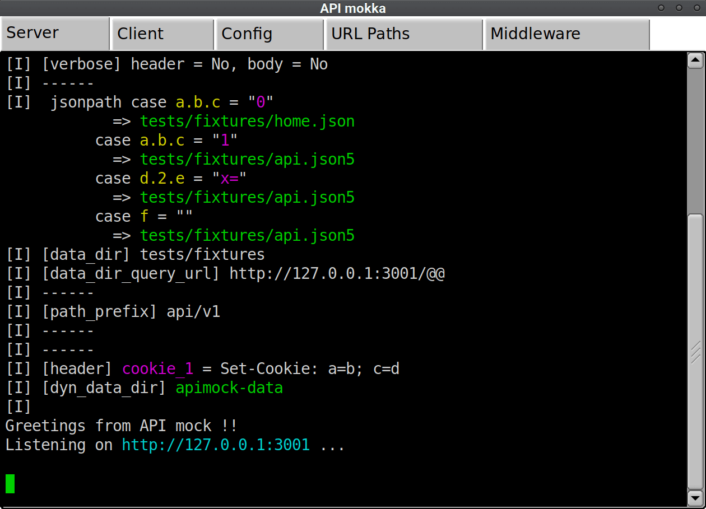

# API mokka

[apimock-rs](https://github.com/nabbisen/apimock-rs) (API mock) based visual mocking helper to handle HTTP/JSON req/res written in Rust.

[](https://crates.io/crates/apimokka)
[](https://docs.rs/apimokka)
[](https://deps.rs/crate/apimokka)
[](https://github.com/nabbisen/apimokka/actions/workflows/release-executable.yaml)
[](https://github.com/nabbisen/apimokka/blob/main/LICENSE)

## 🛠️ App overhaul announcement

### ⚠️ Major update in development (apimock-rs, the core lib, v4)

apimock-rs, the core lib, v4 introduces a fundamental shift in design. Existing configuration files will no longer work as-is. Some features will be deprecated.
In return: cleaner configs, dynamic resolution, and better extensibility.

## Summary

Mock with mokka ☕️🌄

📖 Docs around server [Configure](https://github.com/nabbisen/apimock-rs/blob/main/docs/CONFIGURE.md), and [examples](https://github.com/nabbisen/apimock-rs/blob/main/examples/config/full/)

### Features

- GUI but lightweight as feather
- Intutive terminal and productive tabs
- Built as native and supports cross-platform

## Usage

### Executable

[Assets](https://github.com/nabbisen/apimokka/releases/latest) in Releases offer executables for multiple platforms.

```sh
./apimokka

# at startup, option to generate app default config and middleware files is available:
./apimokka --init
```

Asset includes default config file as an example.

### `cargo` install

```sh
cargo install apimokka
```

## Screenshot



## [Binding for Node.js](napi/README.md)

Cross-platform supporting packages are available via `npm install`.

## Development

```sh
cargo run

cargo test
```

## Acknowledgements

Depends on [apimock-rs](https://github.com/nabbisen/apimock-rs) and [FLTK](https://www.fltk.org/) / [fltk-rs](https://github.com/fltk-rs/fltk-rs). [napi-rs](https://github.com/napi-rs/napi-rs) for binding for [Node.js](https://nodejs.org/).
